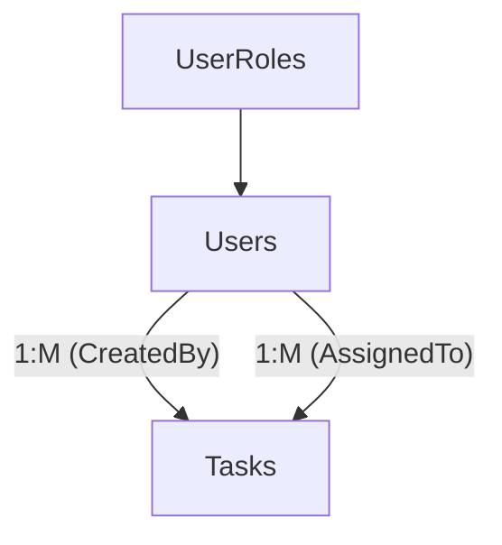
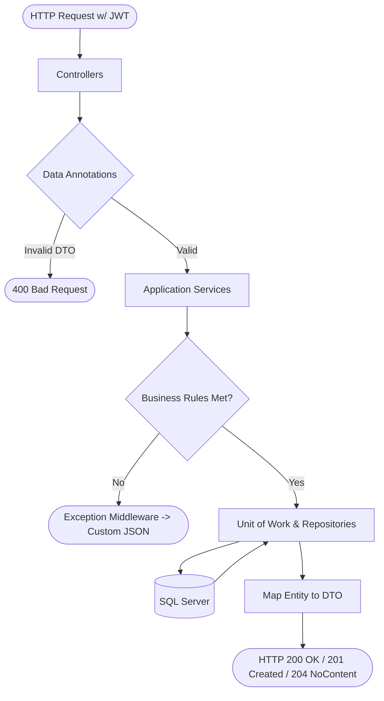
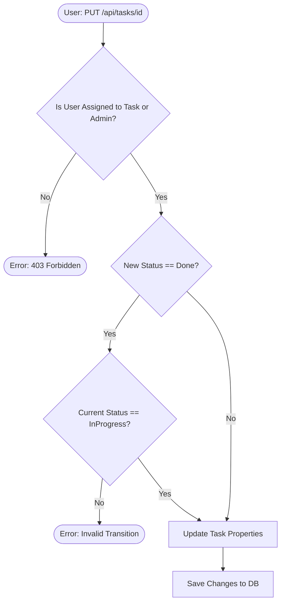

```markdown
# 📝 Task Management System API

A production-level RESTful backend service designed to manage tasks within teams or for individual users. Covers advanced ASP.NET Core concepts including:
Clean Architecture, Unit of Work, Generic Repositories, JWT Authentication, Data Annotations Validation, Pagination, and Global Error Handling.

## 📁 Repository Structure (Clean Architecture)

```text
TaskManagementSystem/
├── TaskManagementSystem.Domain/         # Core Entities, Enums, and Business Models
├── TaskManagementSystem.Application/    # Business Logic (Services), DTOs, Interfaces
├── TaskManagementSystem.Infrastructure/ # EF Core DbContext, UoW, Generic Repositories
├── TaskManagementSystem.API/            # Controllers, Exception Middleware, JWT Config
└── README.md
```

## 🗂️ Entity Relationship Overview


## 🔄 API Request & Architecture Workflow


## 📦 Task Lifecycle & Business Flow



## ⚙️ Core Modules & Business Rules Summary

| Module | Core Endpoints | Business Rules Enforced in Services |
| :--- | :--- | :--- |
| **Tasks** | `POST`, `GET`, `PUT`, `DELETE` | • Due Date cannot be in the past upon creation.<br>• Cannot mark a task as `Done` unless it was `InProgress`.<br>• Users can only update tasks assigned to them (Admins bypass this). |
| **Users** | (Managed via Auth) | • Email addresses must be unique across the system. |
| **Pagination** | `GET /api/tasks` | • Supports filtering by Status, Priority, and Assignee.<br>• Implemented at the DB level (`IQueryable`) for performance.<br>• Returns `X-Total-Count` in HTTP Headers. |

## 🔒 Security & RBAC (Role-Based Access Control)

The API is secured using **JWT (JSON Web Tokens)** with encrypted passwords via `BCrypt.Net-Next`.

| Role | Access Level & Controller Permissions |
| :--- | :--- |
| **Admin** | Full System Access. Can delete any task and view all users. |
| **Manager** | Operational Control. Can view and assign tasks across the team. |
| **User** | Task Execution. Can only view and update tasks specifically assigned to them. |

*(All secure endpoints require the `Authorization: Bearer <Token>` header).*

## 🛡️ Global Error Handling

A custom Middleware intercepts all unhandled application exceptions to prevent stack trace leaks and standardize client responses.

**Example Response for Business Rule Violation:**
```json
{
  "StatusCode": 400,
  "Message": "Task cannot be marked as 'Done' before being 'InProgress'.",
  "Detailed": null
}
```

## 🛠️ Technologies & Patterns Used

* **Framework:** .NET 8 / ASP.NET Core Web API
* **Database:** Entity Framework Core (SQL Server)
* **Architecture:** Clean Architecture 
* **Design Patterns:** Generic Repository, Unit of Work, Dependency Injection (DI)
* **Validation:** Data Annotations
* **Security:** JWT Bearer Authentication, BCrypt Password Hashing
* **Documentation:** Swagger / OpenAPI (Configured for JWT Auth)
* **Error Handling:** Centralized Exception Middleware
```
